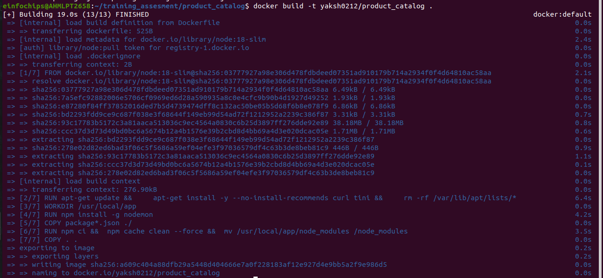

# Training_assesment


### Task 1: Git Repository Setup

1. Create a Git repository to store all project files, including Ansible playbooks,
Dockerfiles, and Kubernetes manifests.

2. Branching Strategy:
    
    + Create branches for development, testing, and production.
    
    + Implement a strategy for merging changes from development to testing and production

<br>


<br>


<br>


### Task 2: Dockerize Microservices

1. Create Dockerfiles for each microservice (front-end, product catalog, order
processing).

+ for the frontend

```Dockerfile
# Define a base stage that uses the official python runtime base image

FROM python:3.11-slim AS base

# Add curl for healthcheck

RUN apt-get update && \
    apt-get install -y --no-install-recommends curl && \
    rm -rf /var/lib/apt/lists/*

# Set the application directory

WORKDIR /usr/local/app

# Install our requirements.txt

COPY requirements.txt ./requirements.txt
RUN pip install --no-cache-dir -r requirements.txt

# Define a stage specifically for development, where it'll watch for

FROM base AS dev
RUN pip install watchdog
ENV FLASK_ENV=development
CMD ["python", "app.py"]

# Define the final stage that will bundle the application for production

FROM base AS final

# Copy our code from the current folder to the working directory inside the container

COPY . .

EXPOSE 80

CMD ["gunicorn", "app:app"]
```

+ for the production

```Dockerfile
FROM node:18-slim

# add curl for healthcheck
RUN apt-get update && \
    apt-get install -y --no-install-recommends curl tini && \
    rm -rf /var/lib/apt/lists/*

WORKDIR /usr/local/app

# have nodemon available for local dev use (file watching)
RUN npm install -g nodemon

COPY package*.json ./

RUN npm ci && \
 npm cache clean --force && \
 mv /usr/local/app/node_modules /node_modules

COPY . .

ENV PORT 80
EXPOSE 80

ENTRYPOINT ["/usr/bin/tini", "--"]
CMD ["node", "server.js"]
```

+ for the order_processing


```Dockerfile
FROM --platform=${BUILDPLATFORM} mcr.microsoft.com/dotnet/sdk:7.0 as build
ARG TARGETPLATFORM
ARG TARGETARCH
ARG BUILDPLATFORM
RUN echo "I am running on $BUILDPLATFORM, building for $TARGETPLATFORM"

WORKDIR /source
COPY *.csproj .
RUN dotnet restore -a $TARGETARCH

COPY . .
RUN dotnet publish -c release -o /app -a $TARGETARCH --self-contained false --no-restore

# app image
FROM mcr.microsoft.com/dotnet/runtime:7.0
WORKDIR /app
COPY --from=build /app .
ENTRYPOINT ["dotnet", "Worker.dll"]
```
+ basically i have define image in such a format where three different docker image will run in one voting app format


2. Build Docker images for each microservice and push them to a container registry
(e.g., Docker Hub).

<br>


<br>


3. Deliverables:
    
    + Dockerfiles for each microservice
    
    + Built Docker images in a container registry





### Task 3: Kubernetes Deployment

1. Create Kubernetes manifests for deploying each microservice.
    
    + Define Pods, Services, Deployments, and ReplicaSets.
    
    + Use ConfigMaps and Secrets for configuration management.

+ i have created 5 different yml two yml as voting and result having frontend and production image 

+ while i have use two separate as db image like postgres and redis


+ for the front-end

```yml
apiVersion: apps/v1
kind: Deployment
metadata:
  name: voting-app-deploy
  labels:
    name: vorting-app-deploy
    app: demo-voting-app
spec:
  replicas: 1
  selector:
    matchLabels:
      name: voting-app-pod
      app: demo-voting-app
  template:
    metadata:
      name: voting-app-pod
      labels:
        name: voting-app-pod
        app: demo-voting-app
    spec:
      containers:
      - name: voting-app
        image: yaksh0212/frontend
        ports:
        - containerPort: 80

```

+ for front-end service

```yml
apiVersion: v1
kind: Service
metadata:
  name: voting-service
  labels:
    name: voting-service
    app: demo-voting-app
spec:
  type: NodePort
  ports:
  - port: 80
    targetPort: 80
    nodePort: 30006
  selector:
    name: voting-app-pod
    app: demo-voting-app
```

+ for result is use production image

```yml

apiVersion: apps/v1
kind: Deployment
metadata:
  name: result-app-deploy
  labels:
    name: result-app-deploy
    app: demo-voting-app
spec:
  replicas: 1
  selector:
    matchLabels:
      name: result-app-pod
      app: demo-voting-app
  template:
    metadata:
      name: result-app-pod
      labels:
        name: result-app-pod
        app: demo-voting-app
    spec:
      containers:
      - name: result-app
        image: yaksh0212/product_catalog
        ports:
        - containerPort: 80

```


+ for its service

```yml

apiVersion: v1
kind: Service
metadata:
  name: result-service
  labels:
    name: result-service
    app: demo-voting-app
spec:
  type: NodePort
  ports:
  - port: 80
    targetPort: 80
    nodePort: 30009
  selector:
    name: result-app-pod
    app: demo-voting-app


```


+ i create a worker image and used order_processing image for it


```yml
apiVersion: apps/v1
kind: Deployment
metadata:
  name: worker-app-deploy
  labels:
    name: worker-app-deploy
    app: demo-voting-app
spec:
  replicas: 1
  selector:
    matchLabels:
      name: worker-app-pod
      app: demo-voting-app
  template:
    metadata:
      name: worker-app-pod
      labels:
        name: worker-app-pod
        app: demo-voting-app
    spec:
      containers:
      - name: worker-app
        image: yaksh0212/order_processing
```

2. Deploy the microservices to a Kubernetes cluster.


+ create a secrete file to make it certified https site

```yml
apiVersion: v1
kind: Secret
metadata:
  name: demo-voting-app
type: Opaque
data:
  NODE_ENV: "key_value " # Base64 encoded value for "production"
```


<br>

3. Deliverables:

    + Kubernetes manifests (YAML files)

    + Successful deployment of microservices in the Kubernetes cluster


<br>

